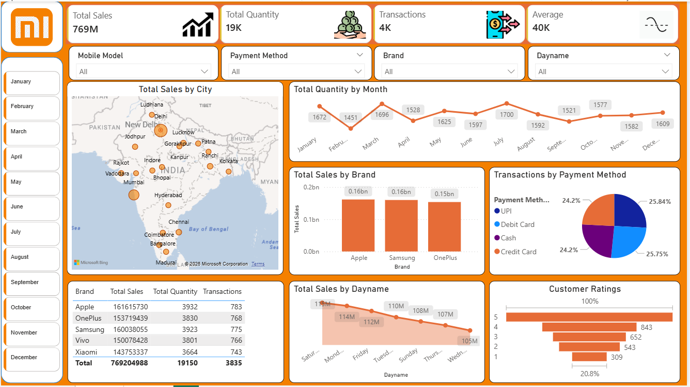

# 📊 Mobile Sales Dashboard (Power BI)

## 📌 Project Overview

This project presents an interactive **Power BI dashboard** designed to analyze mobile sales performance across different cities, brands, and time periods. The dashboard provides insights into sales trends, customer behavior, and transaction patterns to support data-driven decision-making.

---

## 🚀 Key Features

* 📍 **Total Sales Analysis** across multiple cities using map visualization
* 📈 **Monthly Trends** for total quantity sold
* 🏷️ **Brand-wise Sales Comparison** (Apple, Samsung, OnePlus, etc.)
* 💳 **Transaction Analysis** by payment methods (UPI, Debit Card, Credit Card, Cash)
* ⭐ **Customer Ratings Overview**
* 🔍 Interactive **slicers** for filtering by:

  * Month
  * Brand
  * Mobile Model
  * Payment Method

---

## 🛠️ Tools & Technologies

* Power BI
* Microsoft Excel (Data Source)
* Data Cleaning & Transformation
* Data Visualization

---

## 📊 Key Insights

* Identified top-performing cities contributing to overall sales
* Observed monthly fluctuations in product demand
* Compared brand performance to identify market leaders
* Analyzed customer payment preferences and transaction distribution

---

## 📸 Dashboard Preview

---

## 📂 Project Files

* `Mobile_Sales_Dashboard.pbix` → Power BI dashboard file
* `dashboard.png` → Dashboard screenshot
* `README.md` → Project documentation

---

## 🔗 Live Dashboard

*(Add your Power BI Service link here if published)*

---

## 📌 How to Use

1. Download the `.pbix` file
2. Open it using **Power BI Desktop**
3. Interact with filters and visuals to explore insights

---

## 💡 Future Improvements

* Add more datasets for deeper analysis
* Enhance dashboard UI/UX
* Include advanced DAX calculations

---

## 👨‍💻 Author

**Anuj Sharma**
📧 [anujsharmaa0011@gmail.com](mailto:anujsharmaa0011@gmail.com)
🔗 GitHub: https://github.com/Anuj-sharma007
🔗 LinkedIn: https://www.linkedin.com/in/anuj-sharma-717180281/

---
